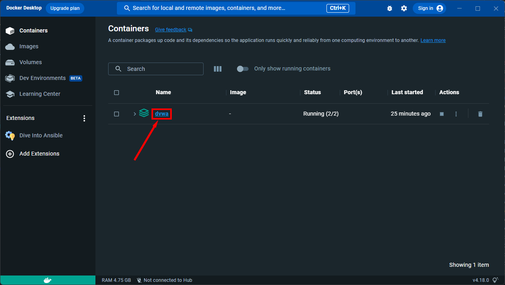
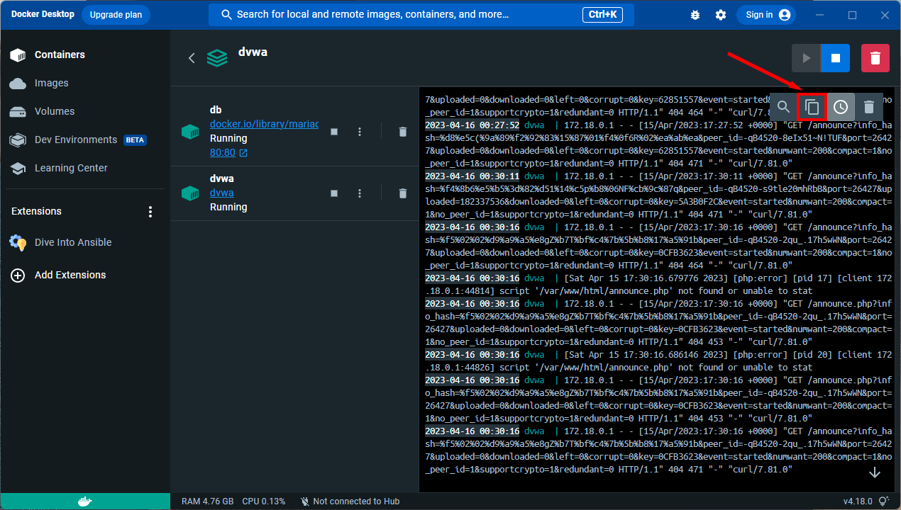

# DAMN VULNERABLE WEB APPLICATION

Damn Vulnerable Web Application (DVWA) to aplikacja internetowa, napisana w PHP/MySQL, bardzo podatna na ataki. Jej głównym celem jest wspieranie specjalistów w testowaniu swoich umiejętności i narzędzi w legalnym środowisku, pomoc programistom w lepszym zrozumieniu procesów zabezpieczania aplikacji internetowych oraz wsparcie zarówno uczniów, jak i nauczycieli w nauce bezpieczeństwa aplikacji internetowych w kontrolowanych warunkach.

Celem DVWA jest **zapoznanie się z najczęściej występującymi podatnościami w aplikacjach internetowych** na **różnych poziomach trudności**, za pomocą prostego i intuicyjnego interfejsu. Należy pamiętać, że oprogramowanie to zawiera **zarówno udokumentowane, jak i nieudokumentowane luki**. Jest to zamierzone. Zachęca się użytkowników do odkrywania jak największej liczby podatności.
- - -

## OSTRZEŻENIE!

Damn Vulnerable Web Application jest bardzo podatny na ataki! **Nie przesyłaj go do folderu public_html na swoim hostingu ani na żadne serwery z dostępem do Internetu**, ponieważ zostanie to wykorzystane. Zalecamy korzystanie z maszyny wirtualnej (takiej jak [VirtualBox](https://www.virtualbox.org/) lub [VMware](https://www.vmware.com/)), z trybem sieci ustawionym na NAT. W maszynie wirtualnej możesz pobrać i zainstalować [XAMPP](https://www.apachefriends.org/), który może Ci posłużyć za serwer WWW i bazę danych.

### Zastrzeżenie

Nie ponosimy odpowiedzialności za sposób, w jaki ktoś używa tej aplikacji (DVWA). Wyjaśniliśmy cele aplikacji i nie powinna być używana w sposób złośliwy. Ostrzegliśmy użytkowników i podjęliśmy odpowiednie kroki, by zapobiec instalacji DVWA na publicznie dostępnych serwerach. Jeśli coś się stanie z Twoim serwerem w wyniku instalacji DVWA, nie ponosimy za to odpowiedzialności – odpowiedzialność spoczywa na osobie lub osobach, które tę aplikację zainstalowały.

- - -

## Licencja

Ten plik jest częścią Damn Vulnerable Web Application (DVWA).

Damn Vulnerable Web Application (DVWA) jest oprogramowaniem wolnym: możesz je rozpowszechniać i/lub modyfikować zgodnie z warunkami GNU General Public License, opublikowanymi przez Free Software Foundation, w wersji 3 tej licencji lub (zgodnie z Twoimi preferencjami) dowolnej późniejszej wersji.

Damn Vulnerable Web Application (DVWA) jest rozpowszechniana z nadzieją, że będzie przydatna, ale BEZ JAKIEJKOLWIEK GWARANCJI; nawet bez domniemanej gwarancji PRZYDATNOŚCI HANDLOWEJ lub PRZYDATNOŚCI DO OKREŚLONEGO CELU. Więcej szczegółów znajdziesz w GNU General Public License.

Powinieneś otrzymać kopię GNU General Public License wraz z Damn Vulnerable Web Application (DVWA). Jeśli nie, zobacz <https://www.gnu.org/licenses/>.

- - -

## Internacionalizacja

Ten plik jest dostępny w kilku wersjach językowych:
- arabski: [العربية](README.ar.md)
- chiński: [简体中文](README.zh.md)
- francuski: [Français](README.fr.md)
- koreański: [한국어](README.ko.md)
- perski: [فارسی](README.fa.md)
- polski: [Polski](README.pl.md)
- portugalski: [Português](README.pt.md)
- hiszpański: [Español](README.es.md)
- turecki: [Türkçe](README.tr.md)
- indonezyjski: [Indonesia](README.id.md)
- wietnamski: [Vietnamese](README.vi.md)

Jeśli chcesz pomóc przy tłumaczeniu, prosimy o zrobienie PR-a (Pull Request). Pamiętaj jednak, że PR-y przetłumaczone automatycznie (np. z Google Translate) zostaną odrzucone. Prześlij swoje tłumaczenie, tworząc nowy plik o nazwie `README.xx.md`, gdzie `xx` to dwuliterowy kod języka (zgodnie z [ISO 639-1](https://en.wikipedia.org/wiki/List_of_ISO_639-1_codes)).

- - -

## Pobieranie

Choć istnieją różne wersje DVWA, jedyną wspieraną jest najnowsza wersja z oficjalnego repozytorium GitHub. Możesz ją sklonować z:

```
git clone https://github.com/digininja/DVWA.git
```

Lub [pobierz archiwum ZIP z plikami](https://github.com/digininja/DVWA/archive/master.zip).

- - -

## Instalacja

### Automatyczna instalacja 🛠️

**Uwaga: to nie jest oficjalny skrypt DVWA, został napisany przez [@IamCarron](https://github.com/IamCarron) i jest utrzymywany w [DVWA-Script](https://github.com/IamCarron/DVWA-Script). Włożono wiele pracy w jego stworzenie i weryfikację, jednak zaleca się przejrzenie skryptu przed uruchomieniem go w systemie. Wszelkie błędy prosimy zgłaszać w [repozytorium DVWA-Script](https://github.com/IamCarron/DVWA-Script), a nie tutaj.**

Skrypt automatycznej instalacji DVWA dla systemów opartych na Debianie (m.in. Kali, Ubuntu, Kubuntu, Linux Mint, Zorin OS...). Automatycznie instaluje wszystkie wymagane zależności, konfiguruje PHP/Apache oraz inicjalizuje tabele bazy danych gotowe do logowania (`admin` / `password`).

**Uwaga: Ten skrypt wymaga uprawnień roota i jest dostosowany do systemów opartych na Debianie. Upewnij się, że uruchamiasz go jako root.**

#### Wymagania instalacji

- **System operacyjny:** Systemy oparte na Debianie (Kali, Ubuntu, Kubuntu, Linux Mint, Zorin OS itp.)
- **Uprawnienia:** Uruchom jako użytkownik root

#### Kroki instalacji

##### Jednolinijkowiec (One-Liner)

Pobierze skrypt instalacyjny napisany przez [@IamCarron](https://github.com/IamCarron) i uruchomi go automatycznie:

```sh
sudo bash -c "$(curl --fail --show-error --silent --location https://raw.githubusercontent.com/IamCarron/DVWA-Script/main/Install-DVWA.sh)"
```

##### Ręczne uruchomienie skryptu

1. **Pobierz skrypt:**

   ```sh
   wget https://raw.githubusercontent.com/IamCarron/DVWA-Script/main/Install-DVWA.sh
   ```

2. **Nadaj uprawnienia do wykonywania:**

   ```sh
   chmod +x Install-DVWA.sh
   ```

3. **Uruchom jako root:**

   ```sh
   sudo ./Install-DVWA.sh
   ```

### Filmy instruktażowe instalacji

- [Instalacja DVWA na Kali w VirtualBox](https://www.youtube.com/watch?v=WkyDxNJkgQ4)
- [Instalacja DVWA na Windows przy użyciu XAMPP](https://youtu.be/Yzksa_WjnY0)
- [Instalacja Damn Vulnerable Web Application (DVWA) na Windows 10](https://www.youtube.com/watch?v=cak2lQvBRAo)

### Windows + XAMPP

Najłatwiejszym sposobem instalacji DVWA jest pobranie i zainstalowanie [XAMPP](https://www.apachefriends.org/), jeśli nie masz jeszcze skonfigurowanego serwera WWW.

XAMPP to łatwy do zainstalowania pakiet Apache, dostępny na systemach Linux, Solaris, Windows i Mac OS X. Zawiera serwer Apache, MySQL, PHP, Perl, serwer FTP i phpMyAdmin.

Ten [film](https://youtu.be/Yzksa_WjnY0) przeprowadzi Cię przez proces instalacji dla systemu Windows, ale na innych systemach powinno to wyglądać podobnie.

### Docker

Dzięki [hoang-himself](https://github.com/hoang-himself) i [JGillam](https://github.com/JGillam), każdy commit na branchu `master` powoduje zbudowanie obrazu Docker, który można pobrać z GitHub Container Registry.

Więcej informacji na temat dostępnych obrazów można znaleźć [tutaj](https://github.com/digininja/DVWA/pkgs/container/dvwa).

#### Pierwsze kroki

Wymagania: Docker i Docker Compose.

- Jeśli korzystasz z Docker Desktop, oba narzędzia powinny być już zainstalowane.
- Jeśli preferujesz Docker Engine na Linuxie, pamiętaj, aby postępować zgodnie z [instrukcją instalacji](https://docs.docker.com/engine/install/#server).

**Zapewniamy wsparcie najnowszej wersji Docker.**
Jeśli używasz Linuxa, a pakiet Docker pochodzi z menedżera pakietów, prawdopodobnie też zadziała, jednak wsparcie będzie ograniczone.

Aktualizacja Docker z wersji menedżera pakietów do wersji głównej wymaga usunięcia starych wersji zgodnie z instrukcją dla [Ubuntu](https://docs.docker.com/engine/install/ubuntu/#uninstall-old-versions), [Fedory](https://docs.docker.com/engine/install/fedora/#uninstall-old-versions) i innych.
Dane Docker (kontenery, obrazy, woluminy itd.) nie powinny być naruszone, jednak w przypadku problemów możesz je zgłosić [Dockerowi](https://www.docker.com/support) i w międzyczasie coś spróbować poszukać.

Aby rozpocząć:

1. Uruchom `docker version` i `docker compose version`, aby sprawdzić, czy Docker i Docker Compose są poprawnie zainstalowane. Powinny pojawić się ich wersje.

    Przykład:

    ```text
    >>> docker version
    Client:
     [...]
     Version:           23.0.5
     [...]

    Server: Docker Desktop 4.19.0 (106363)
     Engine:
      [...]
      Version:          23.0.5
      [...]

    >>> docker compose version
    Docker Compose version v2.17.3
    ```

    Jeśli nie pojawi się nic lub wyświetli się błąd „command not found”, postępuj zgodnie z wymaganiami wstępnymi, aby skonfigurować Docker i Docker Compose.

2. Sklonuj lub pobierz to repozytorium i rozpakuj ([Pobieranie](#download)).
3. Otwórz terminal i przejdź do katalogu `DVWA`.
4. Uruchom `docker compose up -d`.

DVWA jest teraz dostępny pod adresem `http://localhost:4280`.

**Uwaga, serwer WWW działa na porcie 4280 zamiast standardowego portu 80.**
Więcej na temat tej decyzji znajdziesz w sekcji [Chcę uruchomić DVWA na innym porcie](#i-want-to-run-dvwa-on-a-different-port).

### Kompilacja lokalna

Jeśli wprowadziłeś lokalne zmiany i chcesz zbuildować projekt lokalnie, przejdź do `compose.yml` i zmień `pull_policy: always` na `pull_policy: build`.

Uruchomienie `docker compose up -d` powinno spowodować zbudowanie obrazu lokalnie, niezależnie od tego, co jest dostępne w rejestrze.

Zobacz także: [`pull_policy`](https://github.com/compose-spec/compose-spec/blob/master/05-services.md#pull_policy).

### Wersje PHP

Zalecamy używanie najnowszej, stabilnej wersji PHP, ponieważ to na tej wersji aplikacja będzie rozwijana i testowana.

Nie zapewniamy wsparcia dla osób używających PHP 5.x.

Wersje poniżej 7.3 mają znane błędy, które mogą powodować problemy, większość aplikacji będzie działać, ale niektóre funkcje mogą nie funkcjonować prawidłowo. Jeśli nie masz naprawdę ważnego usprawiedliwienia używania starszej wersji, wsparcie nie będzie udzielone.

### Pakiety dla Linuxa

Jeśli korzystasz z dystrybucji opartej na Debianie, musisz zainstalować następujące pakiety _(lub ich odpowiedniki)_:

- apache2
- libapache2-mod-php
- mariadb-server
- mariadb-client
- php php-mysqli
- php-gd

Zalecamy wykonanie aktualizacji przed instalacją, aby upewnić się, że posiadasz najnowsze wersje.

```
apt update
apt install -y apache2 mariadb-server mariadb-client php php-mysqli php-gd libapache2-mod-php
```

Strona będzie działać z MySQL zamiast MariaDB, ale zdecydowanie zalecamy MariaDB, ponieważ działa bez dodatkowej konfiguracji, podczas gdy w przypadku MySQL konieczne są zmiany, aby działało poprawnie.

## Konfiguracje

### Plik konfiguracyjny

DVWA zawiera tylko wzór pliku konfiguracyjnego, który należy odpowiednio zmodyfikować. W systemie Linux, zakładając, że znajdujesz się w katalogu DVWA, można to zrobić w następujący sposób:

`cp config/config.inc.php.dist config/config.inc.php`

Na Windows może to być nieco trudniejsze, jeśli masz ukryte rozszerzenia plików; jeśli masz co do tego wątpliwości, tu jest wyjaśnione więcej:
[Jak wyświetlić rozszerzenia plików w Windows](https://www.howtogeek.com/205086/beginner-how-to-make-windows-show-file-extensions/)

### Konfiguracja Bazy Danych

Aby skonfigurować bazę danych, kliknij przycisk `Setup DVWA` w głównym menu, a następnie przycisk `Create / Reset Database`. Spowoduje to utworzenie lub zresetowanie bazy danych.

Jeśli pojawi się błąd podczas tworzenia bazy danych, upewnij się, że w pliku `./config/config.inc.php` dane logowania do bazy są poprawne. *Jest to inny plik niż config.inc.php.dist, który jest przykładowym plikiem.*

Domyślne wartości zmiennych są następujące:

```php
$_DVWA[ 'db_server'] = '127.0.0.1';
$_DVWA[ 'db_port'] = '3306';
$_DVWA[ 'db_user' ] = 'dvwa';
$_DVWA[ 'db_password' ] = 'p@ssw0rd';
$_DVWA[ 'db_database' ] = 'dvwa';
```

Uwaga: jeśli korzystasz z MariaDB zamiast MySQL (MariaDB jest domyślną bazą danych w Kali), nie możesz użyć użytkownika root bazy danych, musisz utworzyć nowego użytkownika bazy danych. Aby to zrobić, połącz się z bazą danych jako użytkownik root, a następnie użyj następujących poleceń:

```mariadb
MariaDB [(none)]> create database dvwa;
Query OK, 1 row affected (0.00 sec)

MariaDB [(none)]> create user dvwa@localhost identified by 'p@ssw0rd';
Query OK, 0 rows affected (0.01 sec)

MariaDB [(none)]> grant all on dvwa.* to dvwa@localhost;
Query OK, 0 rows affected (0.01 sec)

MariaDB [(none)]> flush privileges;
Query OK, 0 rows affected (0.00 sec)
```

### Wyłączenie Autoryzacji

Niektóre narzędzia nie współgrają z autoryzacją, dlatego nie mogą być używane z DVWA. Aby to obejść, istnieje opcja w konfiguracji do wyłączenia sprawdzania autoryzacji. W tym celu ustaw następującą wartość w pliku konfiguracyjnym:

```php
$_DVWA[ 'disable_authentication' ] = true;
```

Będziesz także musiał ustawić poziom bezpieczeństwa na odpowiedni do testów, które chcesz przeprowadzić:

```php
$_DVWA[ 'default_security_level' ] = 'low';
```

W tym stanie masz dostęp do wszystkich funkcji bez konieczności logowania się i ustawiania jakichkolwiek plików cookie.

### Uprawnienia do Folderów

* `./hackable/uploads/` - Folder ten musi mieć uprawnienia do zapisu dla usługi sieciowej (do przesyłania plików).

### Konfiguracja PHP

W systemach Linux lokalizacja to prawdopodobnie `/etc/php/x.x/fpm/php.ini` lub `/etc/php/x.x/apache2/php.ini`.

* Aby umożliwić zdalne dołączanie plików (Remote File Inclusions, RFI):
    * `allow_url_include = on` [[allow_url_include](https://secure.php.net/manual/en/filesystem.configuration.php#ini.allow-url-include)]
    * `allow_url_fopen = on` [[allow_url_fopen](https://secure.php.net/manual/en/filesystem.configuration.php#ini.allow-url-fopen)]

* Aby upewnić się, że PHP wyświetla wszystkie komunikaty o błędach:
    * `display_errors = on` [[display_errors](https://secure.php.net/manual/en/errorfunc.configuration.php#ini.display-errors)]
    * `display_startup_errors = on` [[display_startup_errors](https://secure.php.net/manual/en/errorfunc.configuration.php#ini.display-startup-errors)]

Upewnij się, że po dokonaniu zmian zrestartujesz usługę PHP lub Apache.

### reCAPTCHA

Jest to wymagane tylko do laboratorium "Insecure CAPTCHA"; jeśli nie używasz tego laboratorium, możesz pominąć ten krok.

Wygeneruj parę kluczy API z <https://www.google.com/recaptcha/admin/create>.

Następnie umieść je w poniższych sekcjach pliku `./config/config.inc.php`:

* `$_DVWA[ 'recaptcha_public_key' ]`
* `$_DVWA[ 'recaptcha_private_key' ]`

### Domyślne Dane Logowania

**Domyślna nazwa użytkownika = `admin`**

**Domyślne hasło = `password`**

_...łatwe do złamania metodą brute-force ;)_

URL logowania: http://127.0.0.1/login.php

_Uwaga: Ten adres będzie inny, jeśli zainstalowałeś DVWA w innym katalogu._
- - -

## Rozwiązywanie problemów

Zakładamy, że używasz dystrybucji opartej na Debianie, takiej jak Debian, Ubuntu lub Kali. W przypadku innych dystrybucji postępuj zgodnie z instrukcjami, dostosowując polecenia, gdzie to konieczne.

### Kontenery

#### Chcę uzyskać dostęp do logów

Jeśli używasz Docker Desktop, logi są dostępne w interfejsie graficznym.
Niektóre drobne szczegóły mogą się zmieniać w nowszych wersjach, ale sposób dostępu powinien pozostać taki sam.




Logi można także uzyskać z terminala.

1. Otwórz terminal i przejdź do katalogu DVWA
2. Wyświetl scalone logi

    ```shell
    docker compose logs
    ```

   Jeśli chcesz wyeksportować logi do pliku, np. `dvwa.log`

   ```shell
   docker compose logs >dvwa.log
   ```

#### Chcę uruchomić DVWA na innym porcie

Nie używamy domyślnie portu 80 z kilku powodów:

- Niektórzy użytkownicy mogą już korzystać z portu 80.
- Niektórzy mogą używać silnika kontenerów bez uprawnień root (jak Podman), a port 80 jest portem uprzywilejowanym (< 1024). Konieczna jest dodatkowa konfiguracja (np. ustawienie `net.ipv4.ip_unprivileged_port_start`), ale musisz zbadać to we własnym zakresie.

Możesz udostępnić DVWA na innym porcie, zmieniając wiązanie portu w pliku `compose.yml`.
Na przykład, możesz zmienić

```yml
ports:
  - 127.0.0.1:4280:80
```

na

```yml
ports:
  - 127.0.0.1:8806:80
```

DVWA będzie teraz dostępne pod adresem `http://localhost:8806`.

Jeśli chcesz, aby DVWA było dostępne nie tylko z Twojego urządzenia, ale także w Twojej sieci lokalnej (np. w przypadku konfiguracji maszyny testowej na warsztaty), możesz usunąć `127.0.0.1:` z mapowania portu (lub zastąpić go swoim adresem IP LAN). Dzięki temu będzie nasłuchiwać na wszystkich dostępnych urządzeniach. Bezpiecznym domyślnym ustawieniem jest nasłuchiwanie wyłącznie na lokalnym urządzeniu loopback, ponieważ jest to bardzo podatna na ataki aplikacja działająca na Twojej maszynie.

#### DVWA uruchamia się automatycznie po włączeniu Dockera

Dołączony plik [`compose.yml`](./compose.yml) automatycznie uruchamia DVWA i jego bazę danych po uruchomieniu Dockera.

Aby wyłączyć tę opcję, możesz usunąć lub zakomentować linie `restart: unless-stopped` w pliku [`compose.yml`](./compose.yml).

Jeśli chcesz tymczasowo wyłączyć tę funkcję, możesz uruchomić `docker compose stop` lub użyć Docker Desktop, znaleźć `dvwa` i kliknąć Stop. Dodatkowo możesz usunąć kontenery lub uruchomić `docker compose down`.

### Pliki logów

W systemach Linux Apache generowane są dwa domyślne pliki logów: `access.log` i `error.log`, a w systemach opartych na Debianie są one zwykle dostępne w `/var/log/apache2/`.

Podczas zgłaszania błędów, problemów itp., prosimy o dołączenie przynajmniej ostatnich pięciu linii z każdego z tych plików. W systemach opartych na Debianie możesz to zrobić w następujący sposób:

```
tail -n 5 /var/log/apache2/access.log /var/log/apache2/error.log
```
### Przejrzałem stronę i otrzymałem błąd 404

Jeśli napotykasz ten problem, musisz zrozumieć lokalizację plików. Domyślnie katalog główny dokumentów Apache (miejsce, gdzie szuka zawartości internetowej) to `/var/www/html`. Jeśli umieścisz plik `hello.txt` w tym katalogu, aby uzyskać do niego dostęp, przejdź do `http://localhost/hello.txt`.

Jeśli utworzysz katalog i umieścisz tam plik - `/var/www/html/mydir/hello.txt` - będziesz musiał przejść do `http://localhost/mydir/hello.txt`.

Linux domyślnie rozróżnia wielkość liter, więc w powyższym przykładzie, jeśli spróbujesz przejść pod którykolwiek z poniższych adresów, otrzymasz błąd `404 Not Found`:

- `http://localhost/MyDir/hello.txt`
- `http://localhost/mydir/Hello.txt`
- `http://localhost/MYDIR/hello.txt`

Jak to wpływa na DVWA? Większość osób korzysta z Gita, aby sklonować DVWA do katalogu `/var/www/html`, co daje im katalog `/var/www/html/DVWA/` ze wszystkimi plikami DVWA wewnątrz. Następnie przechodzą do `http://localhost/`, co skutkuje wyświetleniem błędu `404` lub domyślnej strony powitalnej Apache. Ponieważ pliki są w katalogu DVWA, musisz przejść do `http://localhost/DVWA`.

Innym częstym błędem jest przejście pod `http://localhost/dvwa`, co spowoduje wyświetlenie błędu `404`, ponieważ `dvwa` nie jest tym samym, co `DVWA` według zasad porównywania katalogów w systemie Linux.

Po konfiguracji, jeśli próbujesz odwiedzić stronę i otrzymujesz błąd `404`, zastanów się, gdzie zainstalowałeś pliki, gdzie znajdują się one względem katalogu głównego dokumentów i jaka wielkość liter została użyta w nazwach katalogów.

### "Odmowa dostępu" podczas uruchamiania konfiguracji

Jeśli podczas uruchamiania skryptu konfiguracji pojawi się poniższy komunikat, oznacza to, że nazwa użytkownika lub hasło w pliku konfiguracyjnym nie pasują do tych skonfigurowanych w bazie danych:

```
Database Error #1045: Access denied for user 'notdvwa'@'localhost' (using password: YES).
```

Błąd ten informuje, że używasz nazwy użytkownika `notdvwa`.

Poniższy błąd oznacza, że wskazałeś plik konfiguracyjny na niewłaściwą bazę danych.

```
SQL: Access denied for user 'dvwa'@'localhost' to database 'notdvwa'
```

To oznacza, że używasz użytkownika `dvwa` i próbujesz połączyć się z bazą danych `notdvwa`.

Pierwszym krokiem jest dokładne sprawdzenie, czy to, co myślisz, że wpisałeś w pliku konfiguracyjnym, rzeczywiście tam jest.

Jeśli zgadza się z oczekiwaniami, następnym krokiem jest sprawdzenie, czy możesz zalogować się jako ten użytkownik z linii poleceń. Zakładając, że masz użytkownika bazy danych `dvwa` i hasło `p@ssw0rd`, wykonaj następujące polecenie:

```
mysql -u dvwa -pp@ssw0rd -D dvwa
```

*Uwaga: Po `-p` nie ma spacji.*

Jeśli zobaczysz poniższy komunikat, hasło jest poprawne:

```
Welcome to the MariaDB monitor.  Commands end with ; or \g.
Your MariaDB connection id is 14
Server version: 10.3.22-MariaDB-0ubuntu0.19.10.1 Ubuntu 19.10

Copyright (c) 2000, 2018, Oracle, MariaDB Corporation Ab and others.

Type 'help;' or '\h' for help. Type '\c' to clear the current input statement.

MariaDB [dvwa]>
```

Skoro możesz połączyć się z linii poleceń, prawdopodobnie coś jest nie tak w pliku konfiguracyjnym, sprawdź go ponownie, a jeśli nadal nie działa, zgłoś problem.

Jeśli zobaczysz poniższy komunikat, nazwa użytkownika lub hasło, których używasz, są nieprawidłowe. Powtórz kroki z [Konfiguracji bazy danych](#database-setup) i upewnij się, że używasz tej samej nazwy użytkownika i hasła przez cały proces.

```
ERROR 1045 (28000): Access denied for user 'dvwa'@'localhost' (using password: YES)
```

Jeśli otrzymasz poniższy komunikat, poświadczenia użytkownika są poprawne, ale użytkownik nie ma dostępu do bazy danych. Ponownie powtórz kroki konfiguracji i sprawdź nazwę bazy danych, której używasz.

```
ERROR 1044 (42000): Access denied for user 'dvwa'@'localhost' to database 'dvwa'
```

Ostatnim błędem, jaki możesz otrzymać, jest:

```
ERROR 2002 (HY000): Can't connect to local MySQL server through socket '/var/run/mysqld/mysqld.sock' (2)
```

Nie jest to problem z autoryzacją, ale informacja, że serwer bazy danych nie działa. Uruchom go następującym poleceniem:

```sh
sudo service mysql start
```
### Odmowa połączenia

Błąd podobny do poniższego:

```
Fatal error: Uncaught mysqli_sql_exception: Connection refused in /var/sites/dvwa/non-secure/htdocs/dvwa/includes/dvwaPage.inc.php:535
```

oznacza, że serwer bazy danych nie działa lub masz nieprawidłowy adres IP w pliku konfiguracyjnym.

Sprawdź tę linię w pliku konfiguracyjnym, aby zobaczyć, gdzie oczekiwany jest serwer bazy danych:

```
$_DVWA[ 'db_server' ]   = '127.0.0.1';
```

Następnie przejdź do tego serwera i sprawdź, czy działa. W systemie Linux można to sprawdzić za pomocą:

```
systemctl status mariadb.service
```

Powinieneś zobaczyć coś podobnego, najważniejsza część to `active (running)`.

```
● mariadb.service - MariaDB 10.5.19 database server
     Loaded: loaded (/lib/systemd/system/mariadb.service; enabled; preset: enabled)
     Active: active (running) since Thu 2024-03-14 16:04:25 GMT; 1 week 5 days ago
```

Jeśli serwer nie działa, możesz go uruchomić poleceniem:

```
sudo systemctl start mariadb.service 
```

Pamiętaj o `sudo` i wpisaniu hasła użytkownika Linuxa, jeśli zostaniesz o to poproszony.

W systemie Windows sprawdź status w konsoli XAMPP.

### Nieznana metoda uwierzytelniania

W najnowszych wersjach MySQL domyślna konfiguracja uniemożliwia PHP komunikację z bazą danych. Jeśli podczas uruchamiania skryptu konfiguracji pojawi się następujący komunikat, oznacza to problem z konfiguracją:

```
Database Error #2054: The server requested authentication method unknown to the client.
```

Masz dwie opcje, najprostszą jest odinstalowanie MySQL i zainstalowanie MariaDB. Oficjalny przewodnik projektu MariaDB można znaleźć tutaj:

<https://mariadb.com/resources/blog/how-to-migrate-from-mysql-to-mariadb-on-linux-in-five-steps/>

Alternatywnie, postępuj zgodnie z poniższymi krokami:

1. Jako root edytuj plik: `/etc/mysql/mysql.conf.d/mysqld.cnf`
2. Pod linią `[mysqld]` dodaj następujące:
  `default-authentication-plugin=mysql_native_password`
3. Zrestartuj bazę danych: `sudo service mysql restart`
4. Sprawdź metodę uwierzytelniania dla użytkownika bazy danych:

    ```sql
    mysql> select Host,User, plugin from mysql.user where mysql.user.User = 'dvwa';
    +-----------+------------------+-----------------------+
    | Host      | User             | plugin                |
    +-----------+------------------+-----------------------+
    | localhost | dvwa             | caching_sha2_password |
    +-----------+------------------+-----------------------+
    1 rows in set (0.00 sec)
    ```

5. Prawdopodobnie zobaczysz `caching_sha2_password`. Jeśli tak, wykonaj następujące polecenie:

    ```sql
    mysql> ALTER USER dvwa@localhost IDENTIFIED WITH mysql_native_password BY 'p@ssw0rd';
    ```

6. Po ponownym sprawdzeniu powinieneś zobaczyć `mysql_native_password`.

    ```sql
    mysql> select Host,User, plugin from mysql.user where mysql.user.User = 'dvwa';
    +-----------+------+-----------------------+
    | Host      | User | plugin                |
    +-----------+------+-----------------------+
    | localhost | dvwa | mysql_native_password |
    +-----------+------+-----------------------+
    1 row in set (0.00 sec)
    ```

Po wykonaniu tych kroków proces konfiguracji powinien działać normalnie.

Więcej informacji można znaleźć na stronie: <https://www.php.net/manual/en/mysqli.requirements.php>.

### Błąd bazy danych #2002: Brak takiego pliku lub katalogu.

Serwer bazy danych nie działa. W dystrybucji opartej na Debianie możesz go uruchomić za pomocą:

```sh
sudo service mysql start
```
### Błędy „MySQL server has gone away” i „Packets out of order”

Istnieje kilka przyczyn pojawienia się tych błędów, ale najbardziej prawdopodobną jest niekompatybilność wersji serwera bazy danych z wersją PHP.

Jest to najczęściej spotykane, gdy używasz najnowszej wersji MySQL, ponieważ współpraca między PHP a MySQL nie zawsze przebiega dobrze. Najlepszą radą jest przejście na MariaDB, ponieważ z tego problemu nie możemy zapewnić wsparcia.

Więcej informacji znajdziesz tutaj:

<https://www.ryadel.com/en/fix-mysql-server-gone-away-packets-order-similar-mysql-related-errors/>

### Nie działa Command Injection

Apache może nie mieć wystarczających uprawnień do uruchamiania poleceń na serwerze WWW. Jeśli uruchamiasz DVWA na systemie Linux, upewnij się, że jesteś zalogowany jako root. W systemie Windows zaloguj się jako administrator.

### Dlaczego baza danych nie może się połączyć na CentOS?

Możesz napotkać problemy z SELinux. Możesz wyłączyć SELinux lub uruchomić poniższe polecenie, aby umożliwić serwerowi WWW połączenie z bazą danych:

```
setsebool -P httpd_can_network_connect_db 1
```

### Cokolwiek Innego

W celu uzyskania najnowszych informacji o rozwiązywaniu problemów, przeczytaj zarówno otwarte, jak i zamknięte zgłoszenia w repozytorium Gita:

<https://github.com/digininja/DVWA/issues>

Przed przesłaniem zgłoszenia upewnij się, że używasz najnowszej wersji kodu z repozytorium, a nie najnowszego wydania, tylko kodu z głównej gałęzi.

Przy zgłaszaniu błędu podaj co najmniej następujące informacje:

- System operacyjny
- Ostatnie 5 linii z dziennika błędów serwera WWW bezpośrednio po wystąpieniu zgłaszanego błędu
- Jeśli jest to problem z uwierzytelnianiem do bazy danych, przejdź przez powyższe kroki i wykonaj zrzuty ekranu z każdego kroku. Dołącz je razem z fragmentem pliku konfiguracyjnego zawierającym nazwę użytkownika i hasło do bazy danych.
- Pełen opis problemu, oczekiwany rezultat i działania, jakie podjąłeś, aby go rozwiązać. „Login nie działa” nie wystarczy, abyśmy zrozumieli Twój problem i mogli pomóc.

- - -

## Wstrzykiwanie SQL w SQLite3

_Wsparcie dla tego jest ograniczone; przed zgłaszaniem problemów upewnij się, że jesteś gotowy do pracy nad debugowaniem, nie zgłaszaj po prostu „to nie działa”._

Domyślnie SQLi i Blind SQLi są przeprowadzane na serwerze MariaDB/MySQL używanym przez witrynę, ale można przełączyć testowanie SQLi na SQLite3.

Nie będę omawiać konfiguracji SQLite3 z PHP, ale powinno wystarczyć zainstalowanie pakietu `php-sqlite3` i upewnienie się, że jest włączony.

Aby dokonać przełączenia, edytuj plik konfiguracyjny i dodaj lub zmodyfikuj te linie:

```
$_DVWA["SQLI_DB"] = "sqlite";
$_DVWA["SQLITE_DB"] = "sqli.db";
```

Domyślnie używany jest plik `database/sqli.db`; jeśli go uszkodzisz, po prostu skopiuj `database/sqli.db.dist` na jego miejsce.

Wyzwania są dokładnie takie same, jak dla MySQL, tyle że działają na SQLite3.

- - -

👨‍💻 Współtwórcy
-----

Dziękujemy za wszystkie wkłady i aktualizacje projektu. :heart:

Jeśli masz pomysł, propozycję ulepszenia lub po prostu chcesz współpracować, zapraszamy do udziału w projekcie, śmiało przesyłaj swoje PR.

<p align="center">
<a href="https://github.com/digininja/DVWA/graphs/contributors">
  
</a>
</p>

- - -

## Zgłaszanie błędów

W skrócie: prosimy, nie zgłaszaj ich!

Raz na jakiś czas ktoś zgłasza raport dotyczący błędu, który znalazł w aplikacji – niektóre są dobrze napisane, czasem nawet lepiej niż raporty z testów penetracyjnych, które widziałem, a niektóre to po prostu „brakuje nagłówków, zapłaćcie mi”.

W 2023 roku sytuacja eskalowała, gdy ktoś zgłosił prośbę o nadanie CVE dla jednej z luk, i otrzymał numer [CVE-2023-39848](https://nvd.nist.gov/vuln/detail/CVE-2023-39848). Sytuacja była zabawna i czas został zmarnowany na poprawki.

Aplikacja zawiera podatności i jest to zamierzone. Większość to dobrze udokumentowane przypadki, które analizujesz jako lekcje, inne to „ukryte” luki, które masz znaleźć samodzielnie. Jeśli naprawdę chcesz pokazać swoje umiejętności w odnajdywaniu dodatkowych błędów, napisz post na blogu lub stwórz film – są osoby, które mogą być zainteresowane nauką, jak je znaleźć. Jeśli prześlesz nam link, możemy nawet uwzględnić go w odniesieniach.

## Linki

Strona projektu: <https://github.com/digininja/DVWA>

*Stworzone przez zespół DVWA*
